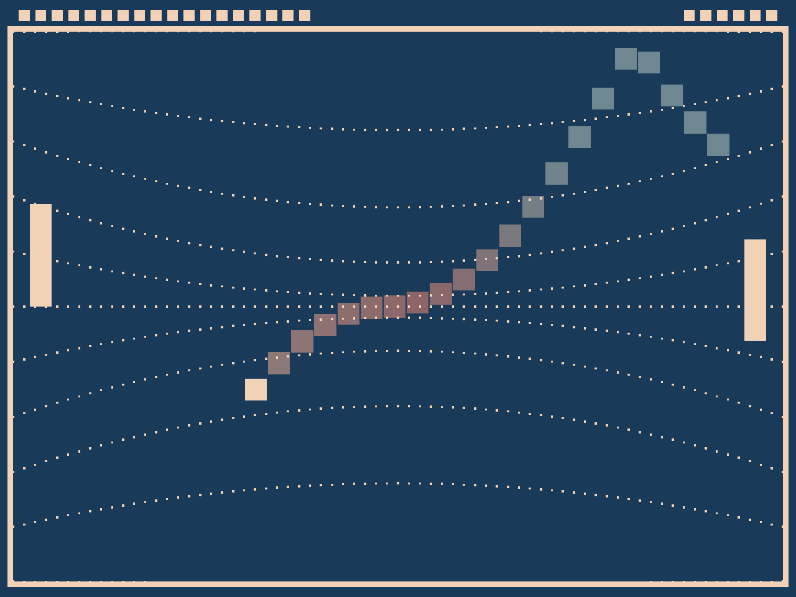

# Curved Pong

Author: Nolan Mass

Design: Curved Pong has the same gameplay as pong but instead of a playing on a flat court, the court is warped (or curved). The gameplay is similar to regular pong but the ball follows curved geodesics (some of which are drawn in the background) and different parts of the court have been expanded or shrunk.

Screen Shot:

How To Play:

The gameplay is exactly the same as Pong, the left paddle follows the mouse. The player scores when the ball hits the right wall and the oponent scores when the ball hits the left wall.

Sources: (TODO: list a source URL for any assets you did not create yourself. Make sure you have a license for the asset.)

This game was built with [NEST](NEST.md).
# game0
